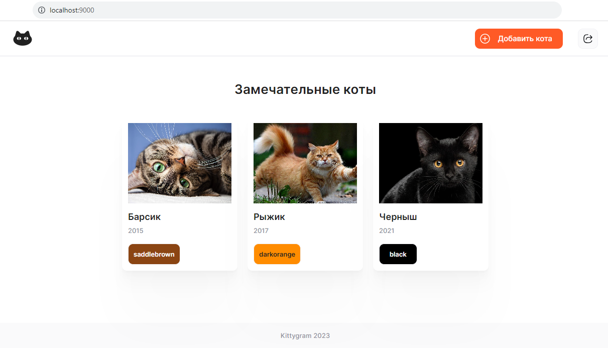
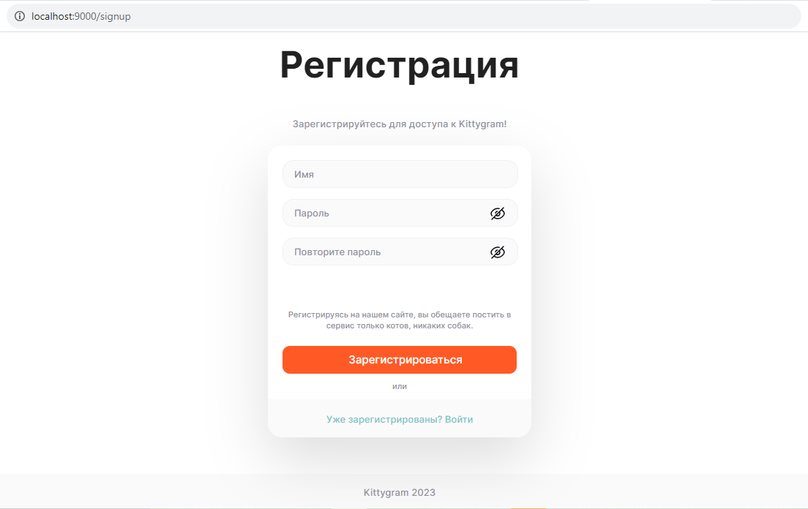
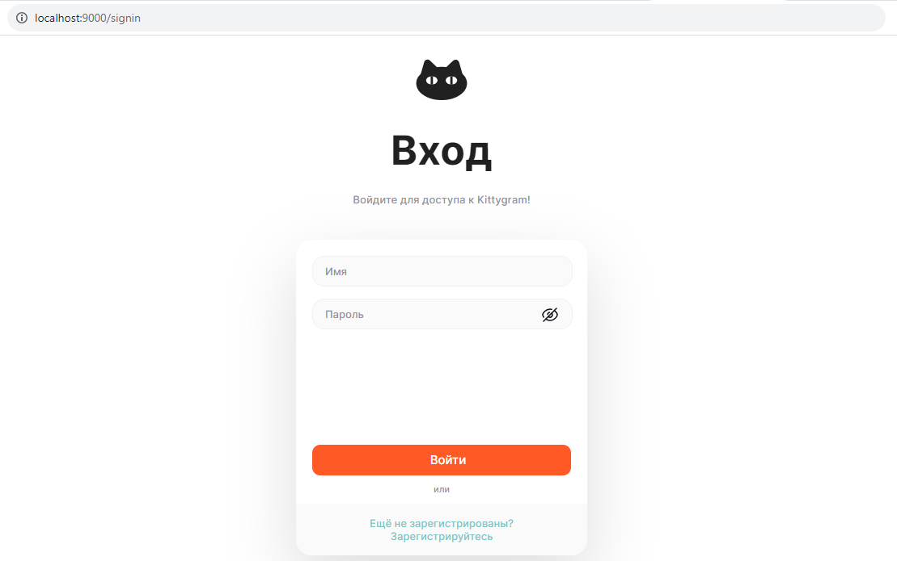
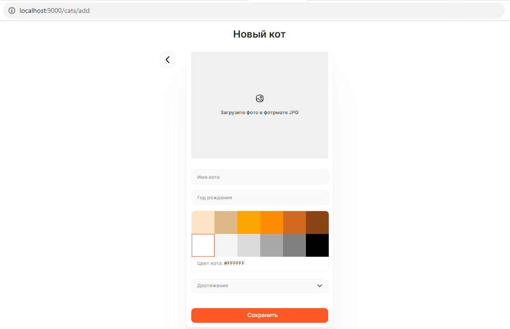
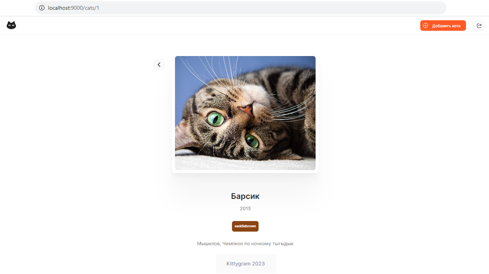

# Kittygram
### Описание проекта:

Проект **Kittygram** - это социальная сеть, где вы можете обмениваться фотографиями любимых питомцев.

### Стек технологий:

- Python 3.10.12
- node.js v18.17.1
- backend: Django
- frontend: React
- nginx
- gunicorn
- PostgreSQL
- Docker
- CI/CD

### Запуск проекта:

Для локального запуска проекта необходимо выполнить действия описанные в файле **README.md** в папках [backend](https://github.com/JuliSem/kittygram_final/blob/main/backend/README.md) и [frontend](https://github.com/JuliSem/kittygram_final/blob/main/frontend/README.md)

### Запуск проекта в контейнерах:

<br>1. После клонирования репозитория, создания файла **.env** в корневой директории проекта, создания и активации виртуального окружения (более подробно действия описаны в файле **README.md** в папке 
[backend](https://github.com/JuliSem/kittygram_final/blob/main/backend/README.md)) запустить файл 
**docker-compose.yml**:

```
docker compose -f docker-compose.yml up
```

<br>2. После этого выполнить следующие команды:

* Выполнить миграции:

    ```
    docker compose -f docker-compose.yml exec backend python manage.py makemigrations
    ```

    ```
    docker compose -f docker-compose.yml exec backend python manage.py migrate
    ```

* Собрать статику:

    ```
    docker compose -f docker-compose.yml exec backend python manage.py collectstatic
    docker compose -f docker-compose.yml exec backend cp -r /app/collected_static/. \
    /backend_static/static/
    ```

### Project's preview:

* **Главная страница**
  
    

* **Страница регистрации пользователя**
 
    

* **Страница входа на сайт**
 
    

* **Страница с добавлением питомца**

    

* **Страница c домашним питомцем**
  
    

### Автор проекта:

Семёнова Юлия (GitHub: JuliSem)
